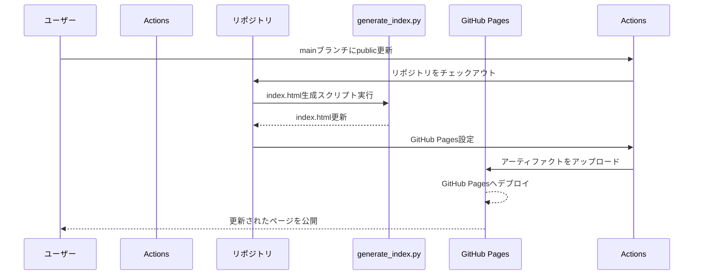

## ./github/workflows/run.yml

```mermaid
sequenceDiagram
    participant User as ユーザー
    participant Actions as GitHub Actions (run.yml)
    participant Main as main.py
    participant Gemini as Gemini API
    participant OpenAI as OpenAI TTS API

    User->>Actions: 手動実行
    Actions->>Main: python main.py
    Main->>Main: テーマ選択・テキスト生成
    Main->>Gemini: ask_gemini(prompt)
    Gemini-->>Main: 文章生成
    Main->>OpenAI: generate_voice(text, voice)
    OpenAI-->>Main: 音声ファイル生成
    Main-->>Actions: ログ保存・音声保存
```

## ./github/workflows/pages.yml

```mermaid
sequenceDiagram
    participant User as ユーザー
    participant GitHubActions as Actions
    participant Repo as リポジトリ
    participant GenerateIndex as generate_index.py
    participant Pages as GitHub Pages

    User->>Actions: mainブランチにpublic更新
    Actions->>Repo: リポジトリをチェックアウト
    Repo->>GenerateIndex: index.html生成スクリプト実行
    GenerateIndex-->>Repo: index.html更新
    Repo->>Actions: GitHub Pages設定
    Actions->>Pages: アーティファクトをアップロード
    Pages-->>Pages: GitHub Pagesへデプロイ
    Pages-->>User: 更新されたページを公開

```
