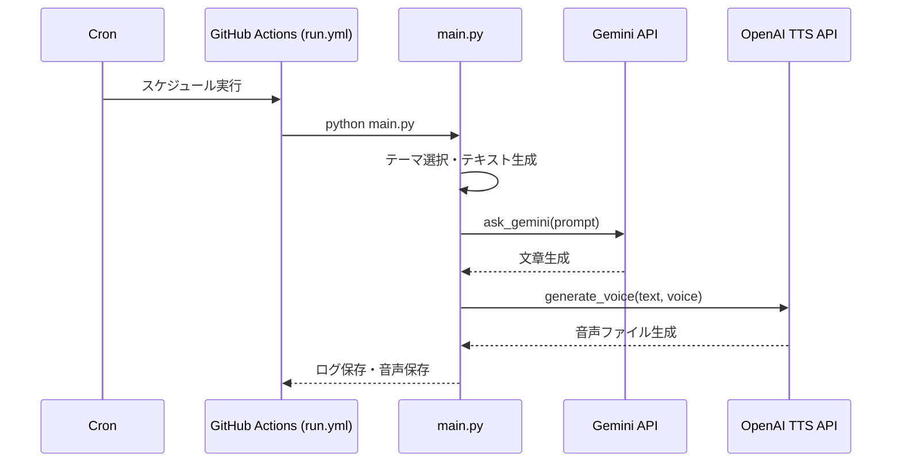
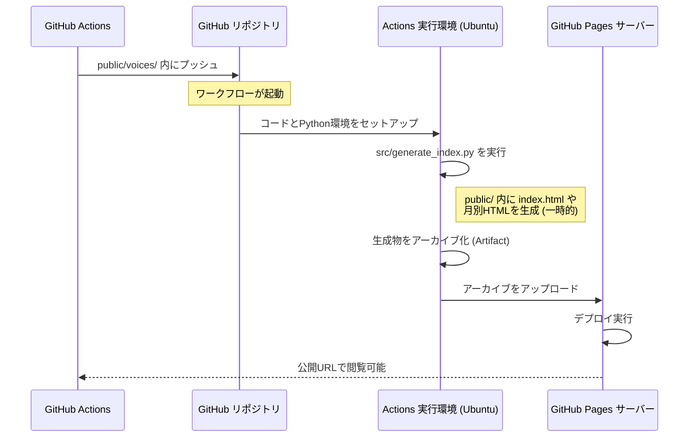

## 生成物
[https://hgssnk.github.io/say-something/index.html](https://hgssnk.github.io/say-something/index.html)

## ./github/workflows/run.yml

```mermaid
sequenceDiagram
    participant User as Cron
    participant Actions as GitHub Actions (run.yml)
    participant Main as main.py
    participant Gemini as Gemini API
    participant OpenAI as OpenAI TTS API

    User->>Actions: スケジュール実行
    Actions->>Main: python main.py
    Main->>Main: テーマ選択・テキスト生成
    Main->>Gemini: ask_gemini(prompt)
    Gemini-->>Main: 文章生成
    Main->>OpenAI: generate_voice(text, voice)
    OpenAI-->>Main: 音声ファイル生成
    Main-->>Actions: ログ保存・音声保存
```

## ./github/workflows/pages.yml

```mermaid
sequenceDiagram
    participant User as GitHub Actions
    participant Repo as GitHub リポジトリ
    participant Runner as Actions 実行環境 (Ubuntu)
    participant Pages as GitHub Pages サーバー

    User->>Repo: public/voices/ 内にプッシュ
    Note over Repo: ワークフローが起動
    Repo->>Runner: コードとPython環境をセットアップ
    Runner->>Runner: src/generate_index.py を実行
    Note right of Runner: public/ 内に index.html や<br/>月別HTMLを生成 (一時的)
    Runner->>Runner: 生成物をアーカイブ化 (Artifact)
    Runner->>Pages: アーカイブをアップロード
    Pages->>Pages: デプロイ実行
    Pages-->>User: 公開URLで閲覧可能
```
